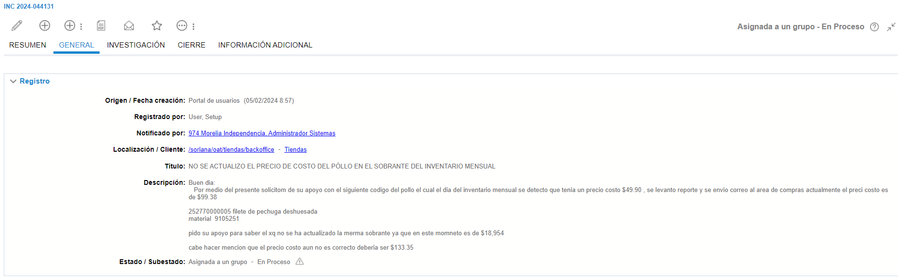
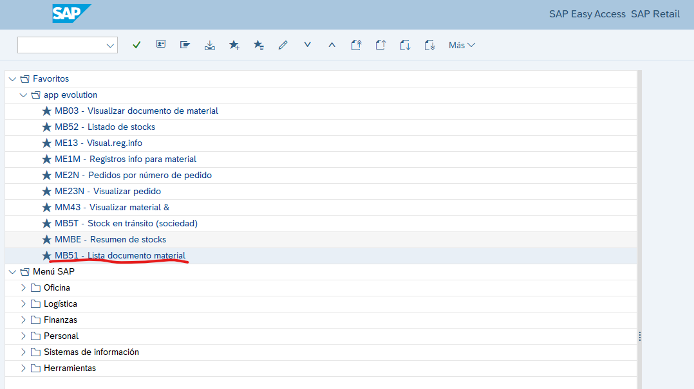
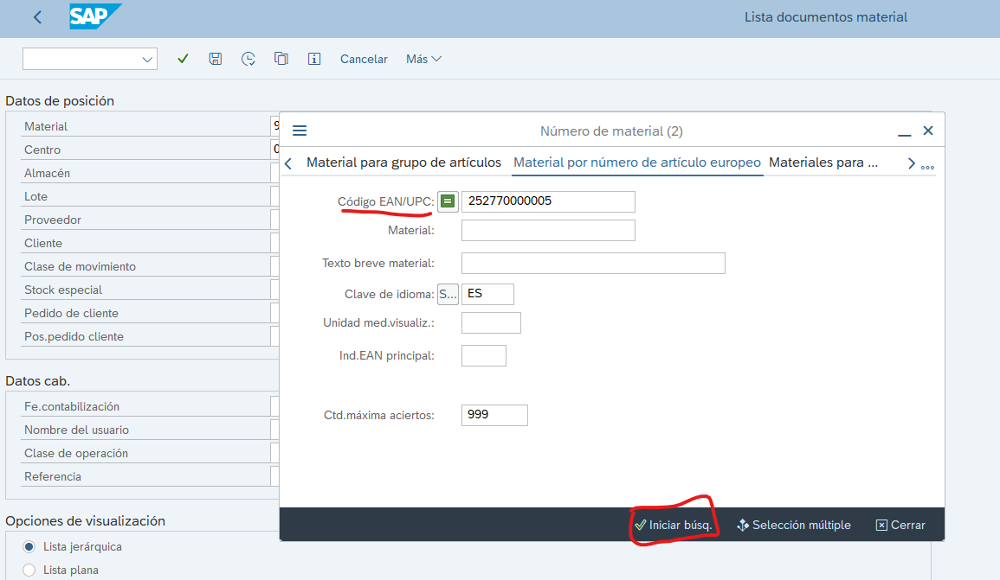
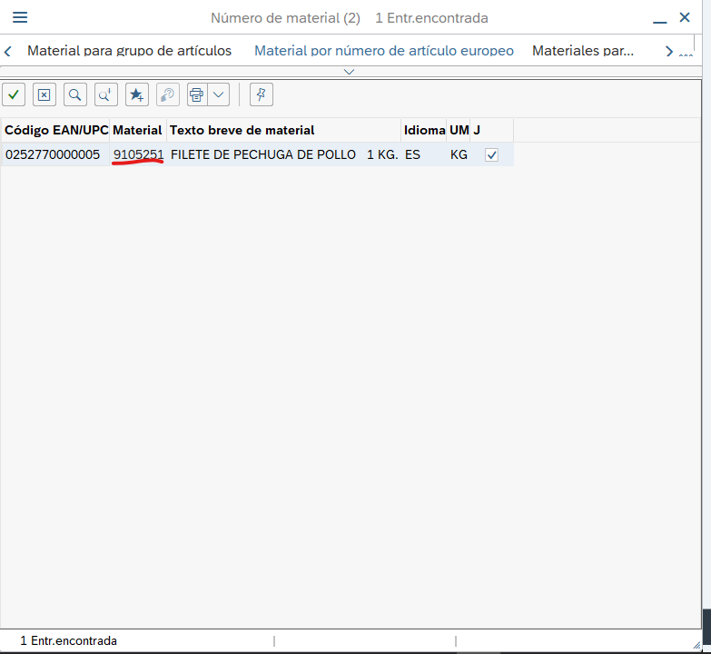
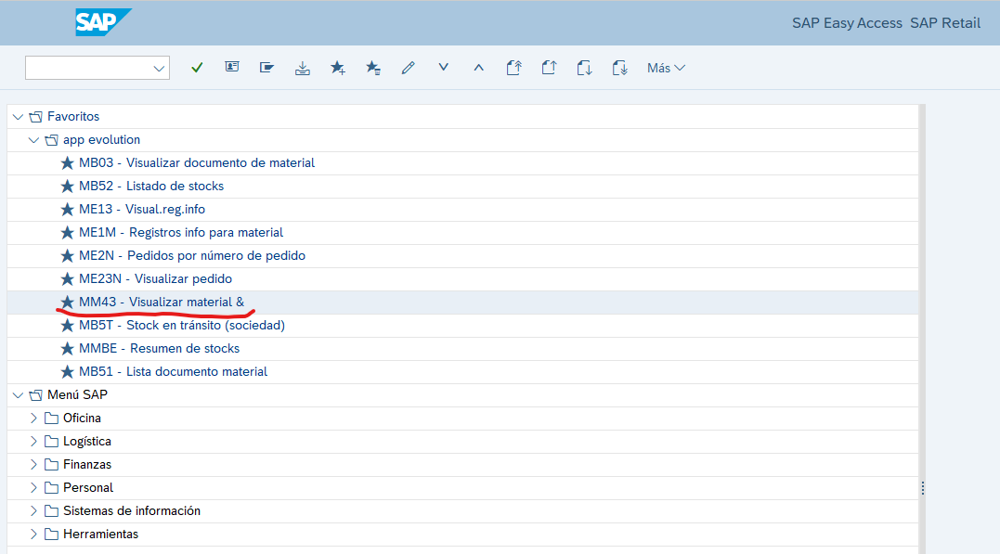
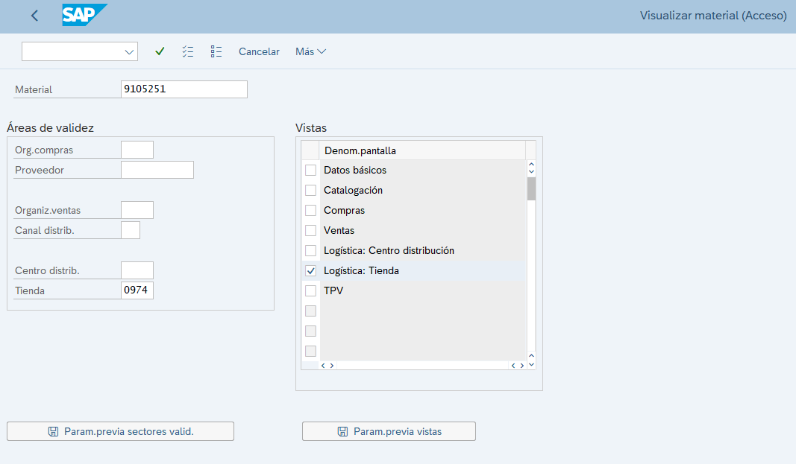
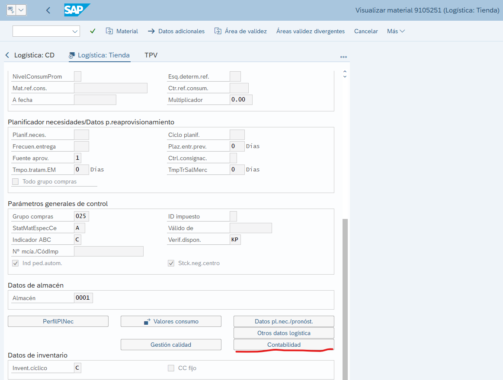
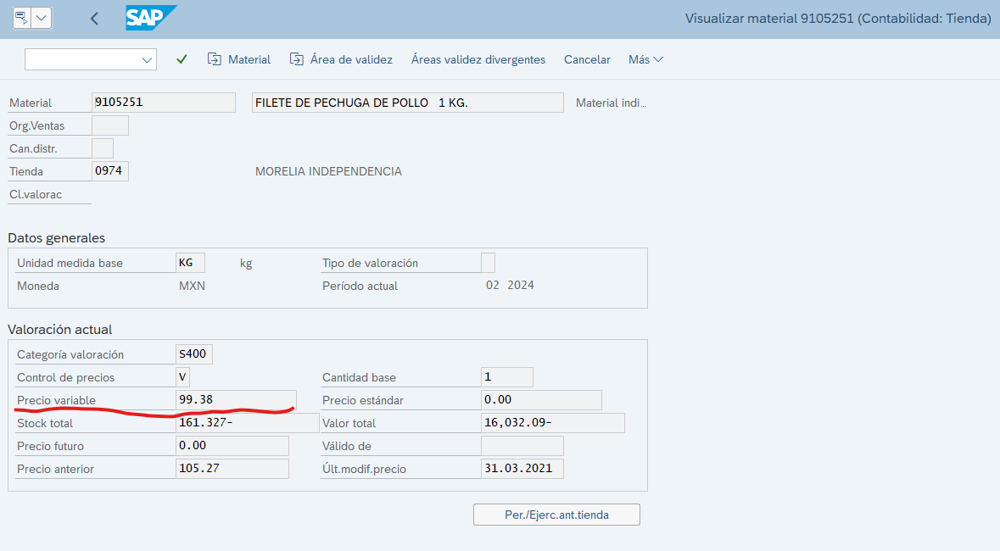

# Aun falta completar, no usar

# Precio incorrecto o actualizacion 

**Titulo:** NO SE ACTUALIZO EL PRECIO DE COSTO DEL PÓLLO EN EL SOBRANTE DEL INVENTARIO MENSUAL

**Descripcion:**
Buen dia:
Por medio del presente solicitom de su apoyo con el siguiente codigo del pollo el cual el dia del inventario mensual se detecto que tenia un precio costo $49.90 , se levanto reporte y se envio correo al area de compras actualmente el preci costo es de $99.38

252770000005 filete de pechuga deshuesada 
material  9105251

pido su apoyo para saber el xq no se ha actualizado la merma sobrante ya que en este momneto es de $18,954

cabe hacer mencion que el precio costo aun no es correcto deberia ser $133.35

CEDIS: 5558 GUADALAJARA 

EMBARQUES: 528767,573300,531716,573301,538538,575264,544389,576760,545587,577985,548816,564498,566799

### Datos que nos proporcionan:

**Precio incorrecto:** 49.90

**Precio correcto:** 99.38

**Codigo de barras:** 252770000005

**Material:** 9105251

**Sucursal:** 974

En caso que solo venga el codigo de barras y no el material, se tienen que ingresar a la **MB51** y seleccionar el icono para mas opciones en la parte de Material que aparece al estar escribiendo en el y despues ir a la parte de ***Material por numero de articulo europeo***  se ingresa el codigo de barras y se da click en **Iniciar busq.**

Aqui optendremos el numero del material

Con este numero de material podremos ir a la **MM43** ***Visualizar material***

Y aqui ingresamos los datos correspondientes, material y centro, seleccionamos ***Logistica: Tienda***

Nos vamos al apartado de **Contabilidad** y se da click

En esta pare se revisa el Precio variable, y se verifica si es correcto o incorrecto, en caso de ser correcto se manda a VoBo para su validacion y en caso de ser incorrecto se manda un correo al area de SAP para su atencion, se mandan las evidencias y los datos correspondientes. Para este ticket estaba de forma correcta pero se deja una tabla de los datos a enviar, igual mandar la captura del precio con el que esta actualmente.

| Ticket ID | Material | Precio incorrecto | Precio correcto | Sucursal |
|-----------|------------------|------------|----------------|----------|
| INC 2024-044131 | 9105251 | 49.90 | 99.38 | 974 |