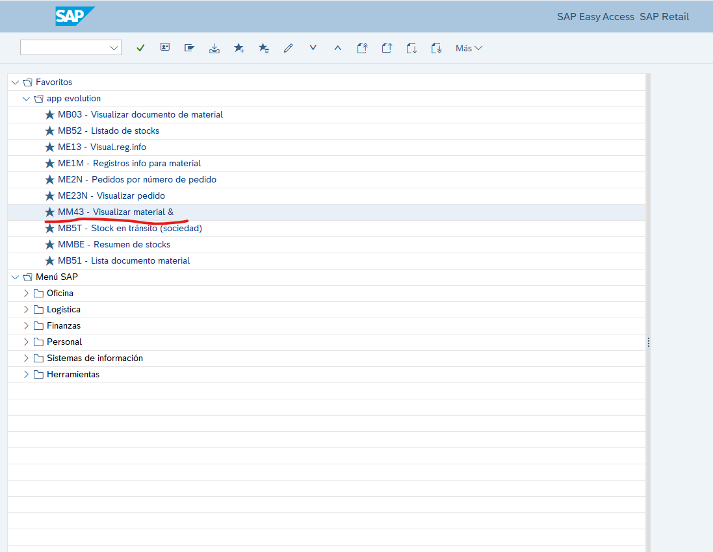
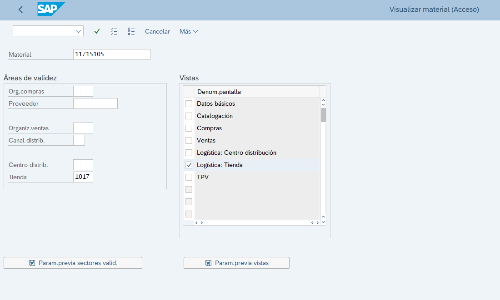
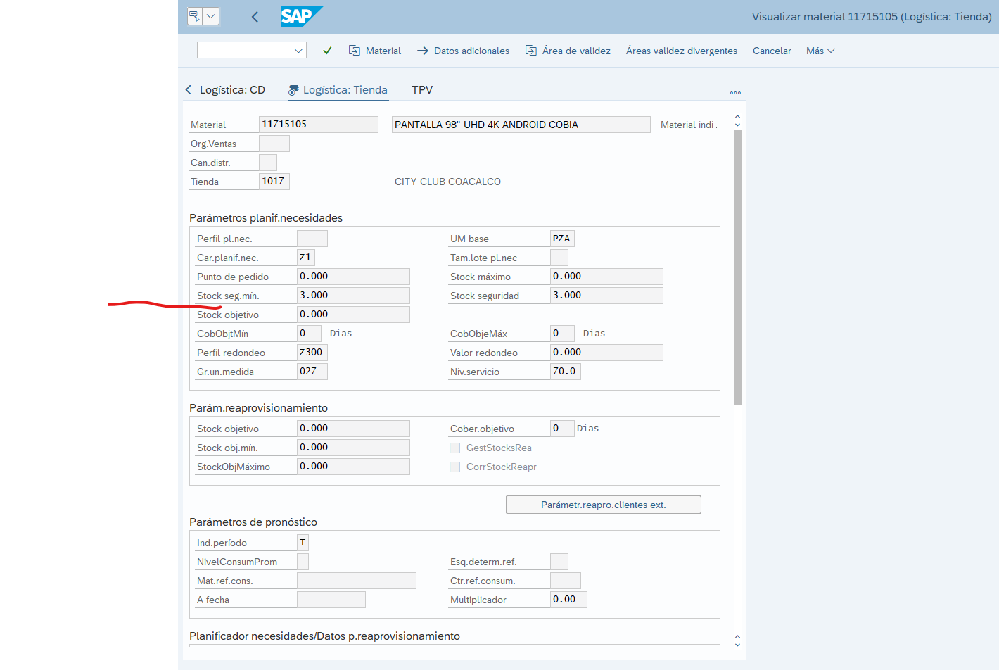

# Stock trasladado excedido

**Título:**
tranferencia entre tiendas no permite recibir

**Descripción:**	
tengo la transferencia 216 de la tienda city 1032 cargada a nosotros y al momento de recibir manda una leyenda envio informacion del error

En este caso se anexa la imagen del error, donde podemos obtener los los siguientes datos y los demas del ticket.

**Materia:** 3133586

**Tienda Origen:** 1032

**Número de transferencia:** 216

**Sucursal:** 1029

Con estos datos vamos a **SAP** enla parte de ***MMBE*** a realizar el analisis de la incidencia

En esta parte ingresamos los dos centros en este caso el 1032 y el 1029 para revisar sus stocks, se le da el cuadro de la derecha para ingresar los dos centros y se ejeguta la consulta

Con esto puede orservarse los siguiente

Otra consulta a realizar es en MySql con el siguiente script, solo se necesita la ***tienda origen*** en este caso **1032** y **folio de la tienda que envia**, en este caso **216**

    -- Transferencias entre Tiendas

    select
        c.externalId as "origen",
        d.externalId as "destino",
        a.trackingNumber as "folio de embarque",
        b.trackingNumber as "folio de transferencia",
        b.claimTrackingNumber as "folio de reclamacion",
        a.status as "estado origen",
        b.status as "estado destino",
        a.type as "tipo",
        a.approvedAt as "tiene aprobacion",
        b.regionalApprovedAt as "tiene autorizacion de regional",
        b.uuid as "uuid",
        a.createdAt as "creacion",
        a.updatedAt as "actualizacion"
    from
        transfers as a
        left join transferslocations as b on b.transferId = a.id
        left join locations as c on a.fromLocationId = c.id
        left join locations as d on b.locationId = d.id
    where
        c.externalId in (1032)						-- Tienda Origen (la que envia)
        and a.type = "STORE"
        and a.trackingNumber in (216)	-- Folio de la tienda que envia
        -- and d.externalId = 307
        ;

    -- fromLocationId 	= Tienda Origen
    -- b.locationId 	=  Tienda Destino
    -- a.trackingNumber	= Folios de Tienda que envia
    -- b.trackingNumber	= Folios de Tienda que recibe

Otra cosa que se revisa en SAP es si cuenta con stock minimo de seguridad en la parte de **Visualizar material** y en la parte de **Logistica de tienda**

Se revisa si tiene este campo con algun valor, lo cual impidiria que quieran ralizar algun movimiento si se excede la cantidad que se tienen que mantener como minimo en la tienda

En este caso se envia a VoBo con el siguiente mensaje, cambiando claro la cantidad de piesas a las correspondientes

    Hola
    
    El error presentado no es un mensaje de error, es un mensaje de advertencia de que tiene un stock minino de seguridad de 3 piezas y si realiza la  
    transferencia de estas se quedaría debajo del umbral permitido, si ocupa una aclaración o cambio tendría que revisarlo con el comprador
    para que le revise el stock de seguridad.
    
    Saludos.

