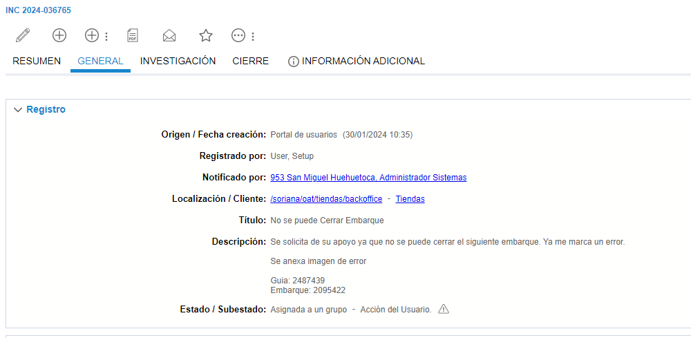
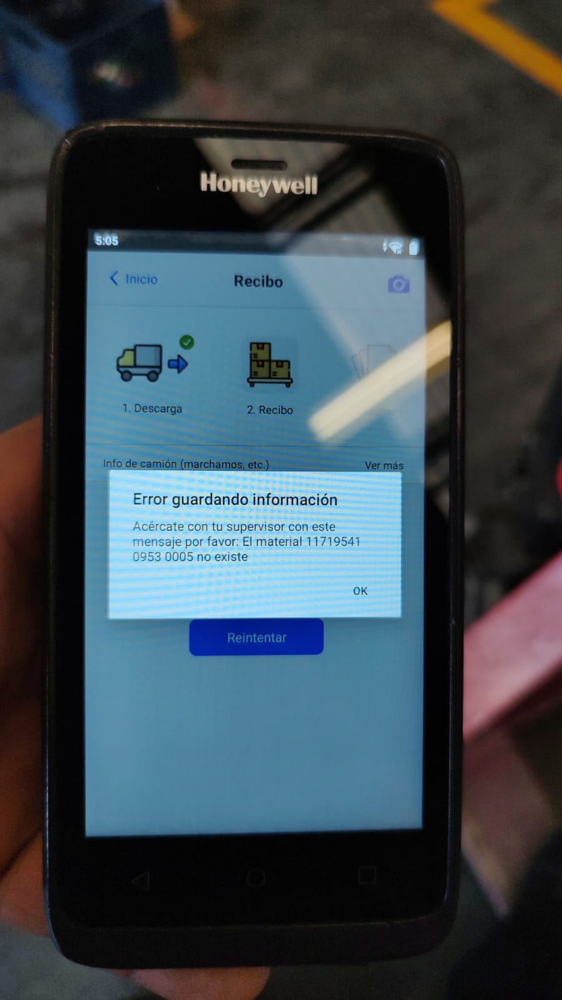

# El material no esxiste

**Título:**
No se puede Cerrar Embarque

**Descripción:**
Se solicita de su apoyo ya que no se puede cerrar el siguiente embarque. Ya me marca un error.

Si se anexa la siguiente imagen o el error se presenta en el Json al consultar el embarque

Se envía correo a ***Claudia Cepeda*** o al equipot de ***SAP*** dependiendo el caso solicitando el Vo.Bo para extensión de material con datos maestros, en este caso el material es el número 11101092, la tienda es la 0032 (Siempre es la de 4 dígitos) y el almacén 0005 (marcado con 4 dígitos), en el siguiente formato. 

En este caso se encia con el siguiente mensaje

Buen día,

Solicito tu apoyo para autorizar la siguiente extensión de material.

| `Ticket`        | `Fecha`    | `Material` | `Centro` | `Almacen` |
|-----------------|------------|------------|----------|-----------|
| INC 2024-044698 | 08/02/2024 | 11719541   | 953      | 0005      |

Hola buen dia, me pueden apoyar con este embarque, ya que no aparece en el monitor

| `Ticket`        | `Cedis`    | `Embarque` | `Guía` | `Sucursal` |
|-----------------|------------|------------|----------|-----------|
| INC 2024-040542 | 5548 | Embarque   | 2218944      | 182      |

