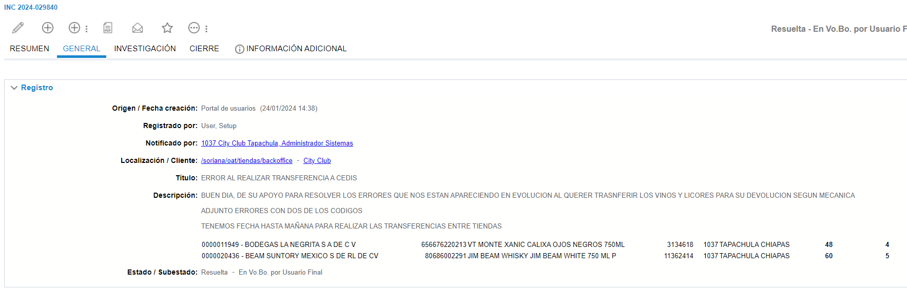
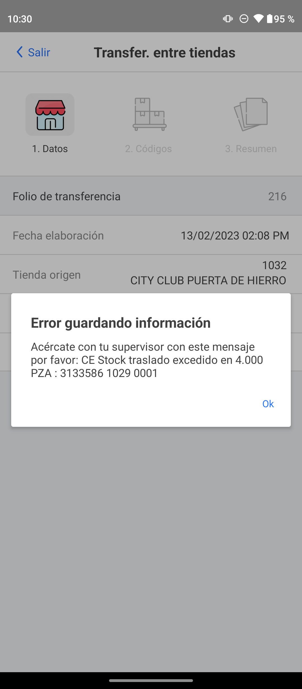

# En proceso de creacion

**Título:** ERROR AL REALIZAR TRANSFERENCIA A CEDIS

**Descripción:**

BUEN DIA, DE SU APOYO PARA RESOLVER LOS ERRORES QUE NOS ESTAN APARECIENDO EN EVOLUCION AL QUERER TRASNFERIR LOS VINOS Y LICORES PARA SU DEVOLUCION SEGUN MECANICA

ADJUNTO ERRORES CON DOS DE LOS CODIGOS

TENEMOS FECHA HASTA MAÑANA PARA REALIZAR LAS TRANSFERENCIAS ENTRE TIENDAS

0000011949 - BODEGAS LA NEGRITA S A DE C V	656676220213	VT MONTE XANIC CALIXA OJOS NEGROS 750ML	3134618	1037	TAPACHULA CHIAPAS	48	4
0000020436 - BEAM SUNTORY MEXICO S DE RL DE CV	80686002291	JIM BEAM WHISKY JIM BEAM WHITE 750 ML P	11362414	1037	TAPACHULA CHIAPAS	60	5

En este caso se anexo la imagen del error, en caso de que no se anexe, pedir de favor que se anexe o si vienene el mensaje de error tambien se puede proceder.

En este caso se procede a enviar el ticket a VoBo con el siguiente mensaje

    Hola

    Para solucionar el incidente por favor diríjanse al equipo de compras y dígales que estos 
    artículos tienen estatus de en proceso de creación por lo que impide realizar ajustes en 
    tienda.

    Para realizar las los ajustes el producto debe estar activo deben cambiarlos a estado activos.

    Quedamos atentos.
