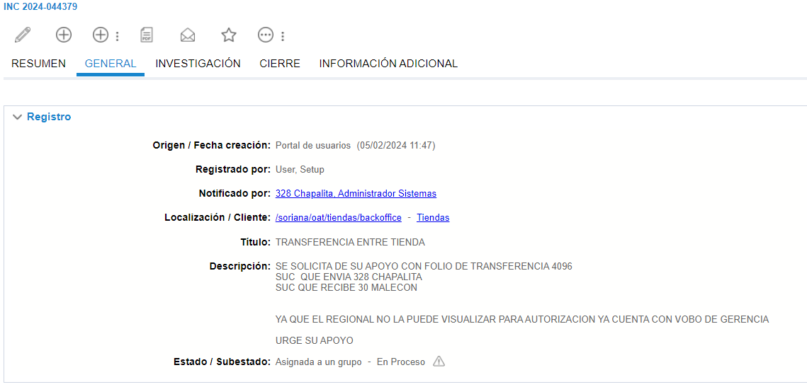
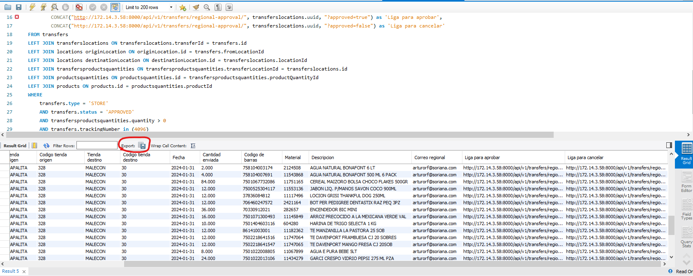

# Precio incorrecto o actualizacion

**Titulo:** TRANSFERENCIA ENTRE TIENDA

**Descripcion:**
SE SOLICITA DE SU APOYO CON FOLIO DE TRANSFERENCIA 4096
SUC  QUE ENVIA 328 CHAPALITA 
SUC QUE RECIBE 30 MALECON
 

YA QUE EL REGIONAL NO LA PUEDE VISUALIZAR PARA AUTORIZACION YA CUENTA CON VOBO DE GERENCIA

URGE SU APOYO 

### Datos que nos proporcionan:

**Tienda origen:** 328

**Tienda recibe:** 30

**Numero de transferencia:** 4096

Para este caso es necesario ingresar a MySql para realisar la consulta con el siguiente script donde ingresaremos los datos correspondientes.

    SELECT
        transfers.trackingNumber as 'Folio de Embarque',
        transferslocations.trackingNumber as "folio de transferencia",
        transferslocations.claimTrackingNumber as "folio de reclamacion",
        #transfers.status as 'Estado',
        UPPER(originLocation.name) as 'Tienda origen',
        originLocation.externalId as 'Codigo tienda origen',
        UPPER(destinationLocation.`name`) as 'Tienda destino',
        destinationLocation.externalId as 'Codigo tienda destino',
        date(transfers.createdAt) as 'Fecha',
        transfersproductsquantities.quantity as 'Cantidad enviada',
        productsquantities.sku as 'Codigo de barras',
        productsquantities.sapNumber as 'Material',
        products.name as 'Descripcion',
        REPLACE(JSON_EXTRACT(destinationLocation.emails, "$.regional[1]"), "\"", '') as 'Correo regional',
            CONCAT("http://172.14.3.58:8000/api/v1/transfers/regional-approval/", transferslocations.uuid, "?approved=true") as 'Liga 
            para aprobar',
            CONCAT("http://172.14.3.58:8000/api/v1/transfers/regional-approval/", transferslocations.uuid, "?approved=false") as 'Liga 
            para cancelar'
    FROM transfers
    LEFT JOIN transferslocations ON transferslocations.transferId = transfers.id
    LEFT JOIN locations originLocation ON originLocation.id = transfers.fromLocationId
    LEFT JOIN locations destinationLocation ON destinationLocation.id = transferslocations.locationId
    LEFT JOIN transfersproductsquantities ON transfersproductsquantities.transferLocationId = transferslocations.id
    LEFT JOIN productsquantities ON productsquantities.id = transfersproductsquantities.productQuantityId
    LEFT JOIN products ON products.id = productsquantities.productId
    WHERE 
        transfers.type = 'STORE' 
        AND transfers.status = 'APPROVED' 
        AND transfersproductsquantities.quantity > 0
        AND transfers.trackingNumber in (4096)
        AND originLocation.externalId in (328);

Se realiza la consulta y se exporta como un CSV

Este CSV se envia arturorf@soriana.com gerente regional que se obtiene de la misma consulta de la columna ***Correo regional***, en este caso se pone ese correo pero esta cambia acorde a cada sucursal.

NOTA: No agregar ningun dato mas que el CSV.

Asusto: Transferencias pendientes por autorizar 14

Despues se manda a visto buendo indicando que fue eviado al correo

    Hola buen día, se realizo nuevamente el reenvió del correo para su aprobación o cancelación del las transferencias a la parte regional al correo lazaromir@soriana.com

    Gracias, saludos