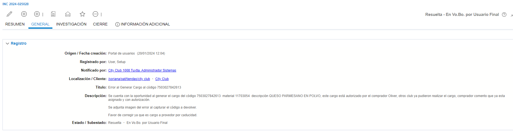
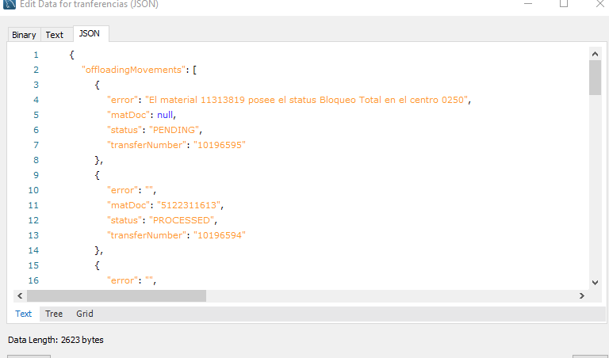

# Bloqueo Total

**Título:**
ERROR EMBARQUE

**Descripción:**
no permite dar arribo a embarque

 

Se revisa el embarque en MySql con el siguiente escript 

    call consultarEmbarque(2096452);

Si aparece un mensaje similar a este 

 

Se manda a VoBo con el siguiente mensaje

    Estimado usuario, 
    
    El mensaje que regresa el sistema no es un error, es una validación ya que un material con status de Bloqueo a la Compra no es válido para generar movimientos en la APP (Ajustes, Mermas, Transferencias, etc.) Se revisa en el sistema y se detecta que el material está en status BT para su tienda, cambio realizado por el área de compras.