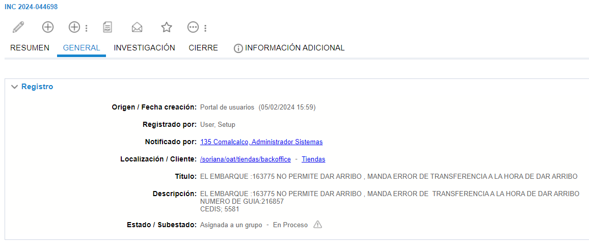
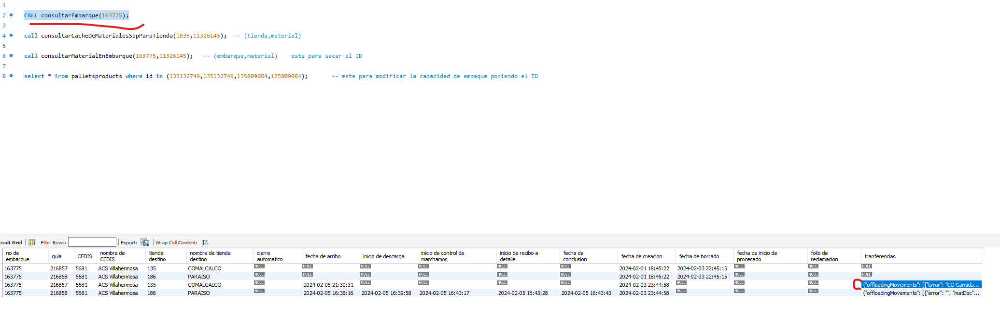
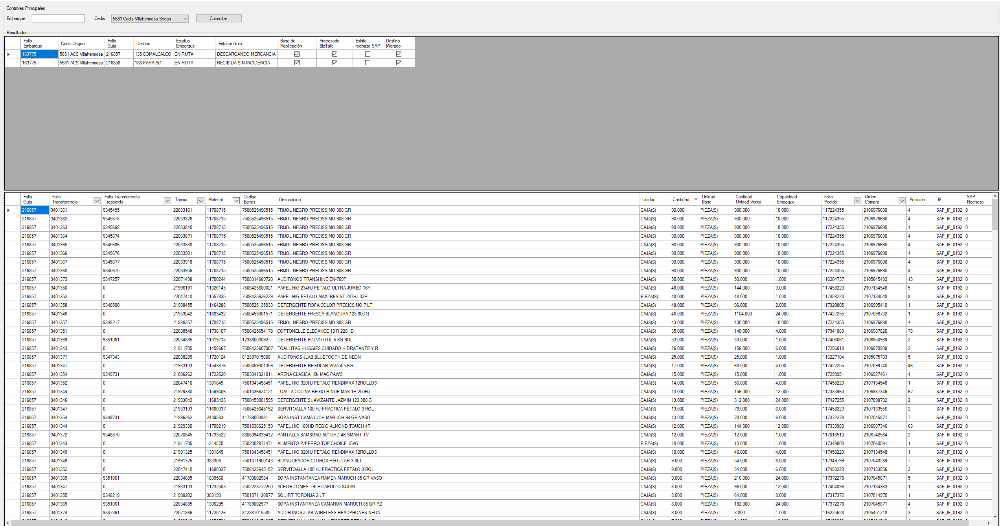
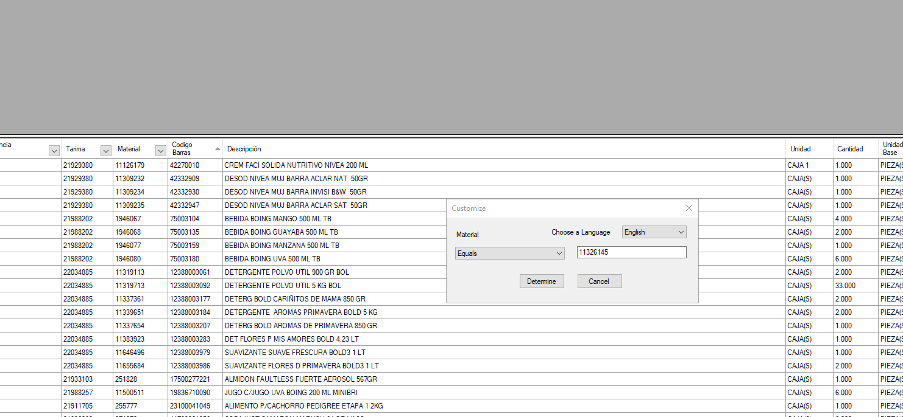
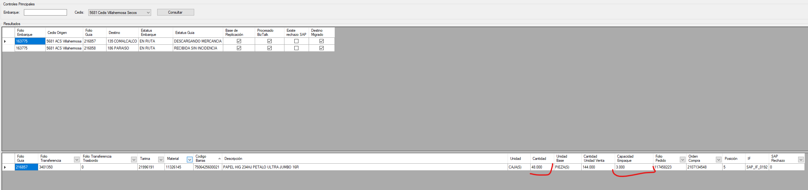
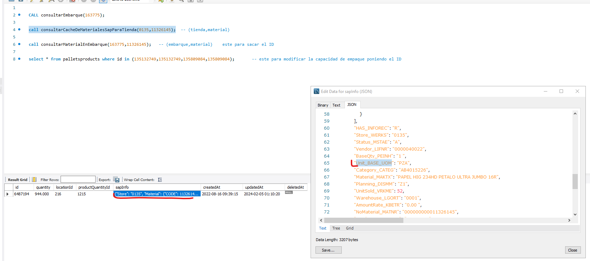
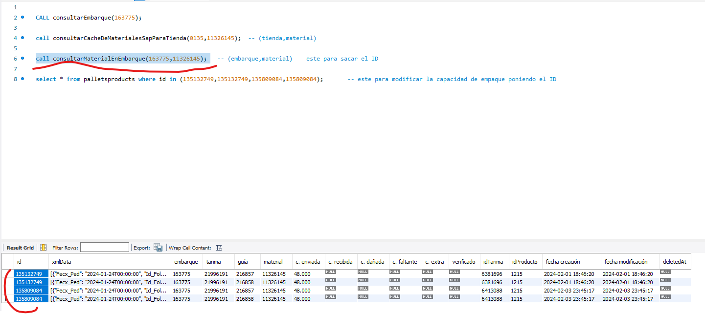
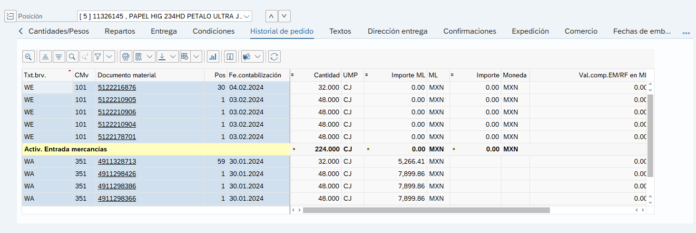

# Cantidad excedido en CJ

**Título:**
EL EMBARQUE :163775 NO PERMITE DAR ARRIBO , MANDA ERROR DE TRANSFERENCIA A LA HORA DE DAR ARRIBO

**Descripción:**
EL EMBARQUE :163775 NO PERMITE DAR ARRIBO , MANDA ERROR DE  TRANSFERENCIA A LA HORA DE DAR ARRIBO
NUMERO DE GUIA:216857
CEDIS; 5581

Para este caso se comienza con el analisis en MySql consultando el embarque para ver su estatus y el error que contiene, en este caso es el siguiente 

**Scriopt:**

    CALL consultarEmbarque(163775);

**Json:**

    {
        "error": "CO Cantidad tomada excedido en 48.000 CJ : 11326145 0135 0001",
        "matDoc": null,
        "status": "PENDING",
        "transferNumber": "3401350"
    }

Una ves tengamos esto, lo que nos interesa del JSON es el numero del material, que para este caso es el ***11326145***, el cual vamos a utilizar en el monitor de embarques para filtar por el Material

Una ves filtrado, lo que nos interesa es la parte de los siguientes campos

**Cantidad:** 48
**Capacidad de empaque:** 3

Con estos datos aplicamos la formula de Cantidad / capacidad de empaque

48 / 3 = 16

Este dato no servira mas adelante, regresamos a MySql y realizamos las siguentes consultas

    call consultarCacheDeMaterialesSapParaTienda(0135,11326145);
  
  

Aqui los datos que nos importan son los marcados, abrimos el json y el campo ***Unit_BASE_UOM*** que en este caso viene como PZA

    call consultarMaterialEnEmbarque(163775,11326145); 

 

De aqui los datos que importan solo los ***ID*** que se utilizaran en la siguiente consulta

    select * from palletsproducts where id in (135132749,135132749,135809084,135809084);

Tambien se verifica en ***SAP*** el pedido para revisar la posicion y ver los movimientos y cantidades que se reciben

Como se puede observar las cantidades que se muestran en el **Monitor de embarques** y **SAP** son diferentes, por lo cual es necesario pedir el apoyo de Cedis para que revisen el pedido de su lado y verificar si cuenta con algun error.

Se envian las evidencias del **Monitor de embarques** y **SAP** con los siguientes datos para su atencion.

**Error:** CO Cantidad tomada excedido en 48.000 CJ : 11326145 0135 0001

| `Ticket`        | `Embarque` | `Cedis` | `Sucursal` | `STO Pedido` | `Material` | `Transferencia` | `Folio Gía` | `Folio transferencia` |
|-----------------|------------|---------|----------|--------------|--------------|-----------------|-------------|-----------------------|
| INC 2024-044698 | 163775      | 5681    | 135     | 2107134548   | 11326145     | 3401350         | 216857      | 3401350               |

El recibo fue creado exitosamente con número 4911424057

Embarques excedidos por n piezas
 
FORMULA
 
en monitor es el numero en capacidad de empaque / (se divide) la unidad que se tiene en el cache de material en este ejemplo es  paquetes y en
el json de este procedure
call consultarCacheDeMaterialesSapParaTienda(1041, 11392024);  (tienda,material)
en la parte de abajo se obserba el campo Unit_BASE_UOM que para este ejemplo es paquete
 
y ya con la conversion dentro del json
 
"Unit_MEINS": "PAQ",
                "Volume_VOLUM": "0.000 ",
                "UnitWeigth_GEWEI": "KG",
                "GrossWeight_BRGEW": "0.000 ",
                "UnitNumerator_UMREZ": "4 ",
                "UnitDenominator_UMREN": "1 "
es un 4 por lo que en un ejemplo practico seria 
capacidad de empaque 1152.000
unidad paquete = 4
1152/4 = 288
 
y este valor como se observo se cambia en
 
call consultarMaterialEnEmbarque(4611,11672416)   (embarque,material)    este para sacar el ID   
 
select * from palletsproducts where id in (126543358,126543360);       este para modificar la capacidad de empaque poniendo el ID  
 
y se cambia el valor de "Cap_Empaque": "288.000" dentro del json
 
apply y luego apply y listo
 
 
"Unit_BASE_UOM": "PAQ",
 
CALL consultarEmbarque(13766);
 
call consultarCacheDeMaterialesSapParaTienda(1021,11769592);  (tienda,material)
 
call consultarMaterialEnEmbarque(15949,11769592)   (embarque,material)    este para sacar el ID   
 
select * from palletsproducts where id in (134475897);       este para modificar la capacidad de empaque poniendo el ID  

se busca en monitor y el error en mysql
 
en monitor dira la cantidad correcta validando el numero de material que sale en el error del json
 
El json se puede encontrar a la derecha de la salida en el siguiente procedure
 
Dato de entrada numero de embarque.
CALL consultarEmbarque(880415);
 
con la orden de compra se consulta en sap en la ME23N  para la posicion indicada en el json y para este ESCENARIO se observo que las 351 vienen en decimales.
 
Despues de revisar para en caso que los movimientos 351 sea la capacidad de estos en SAP con numeros decimales se les manda correo a CEDIS(todo es culpa de cedis)
 
Se envia a
 
SoporteImplementacionWM@soriana.com
copia
 
Soporte App Evolution <soporteappevolution@soriana.com>

 
Hola Compañeros del CEDIS
 
De su apoyo para la revisión de este escenario ya que tenemos problemas con cantidades en decimales en SAP.
 
Embarque 16029
CEDIS 5645
Folio Transferencia:  671159
Material: 3070108
 
Vemos que el 351 se generó con decimales.
 
Pantalla de sap de la ME23N y del monitor de enbarques.
 
Nosotros solicitamos una reversa de la 351 con decimales mal y cedis la reenviara con valores correctos.
Solo si CEDIS confirma que esta mal y que lo requieren reenviar.
 
 
Este problema se comunica a claudia y a cedis
Claudia se comunicara con cedis para checar por que esta excedido
 
De momento el TT se pone como N3

| Ticket ID      | Embarque | Cedis | Folio Transferencia | Material |
|----------------|----------|-------|---------------------|----------|
|INC 2024-043858 | 14040    | 5647  | 671159              | 3070108  |

