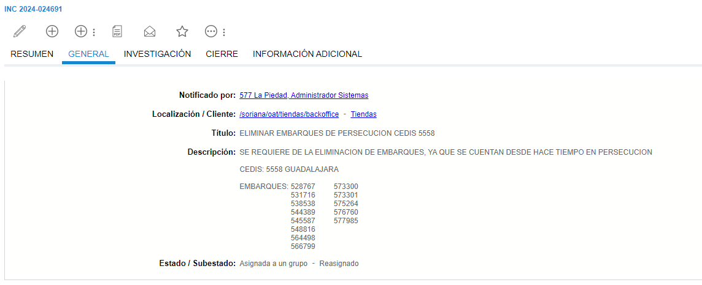
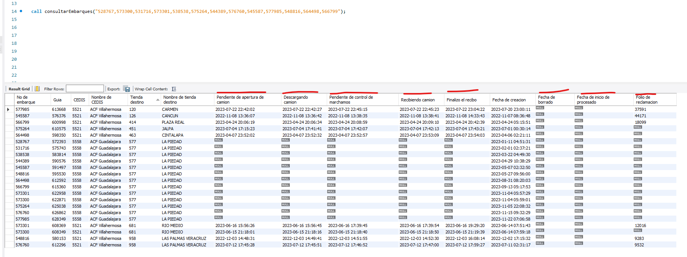
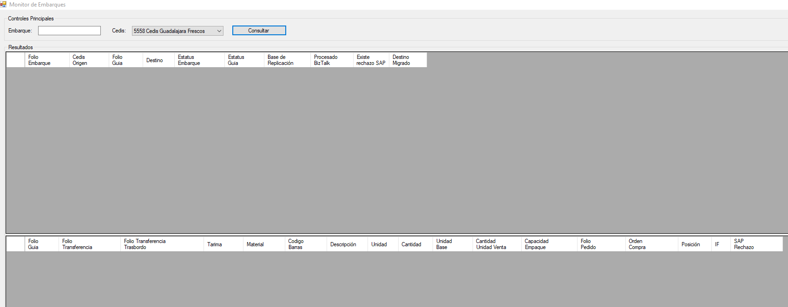
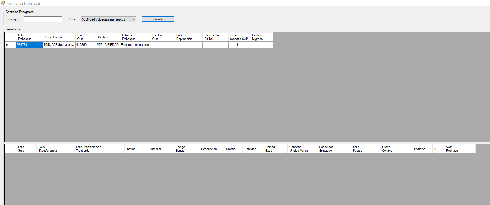
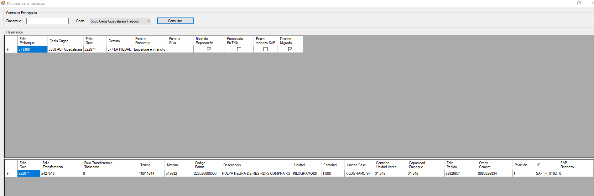

# ELIMINAR EMBARQUES DE PERSECUCION CEDIS

**Titulo:** ELIMINAR EMBARQUES DE PERSECUCION CEDIS 5558

**Descripcion:** SE REQUIERE DE LA ELIMINACION DE EMBARQUES, YA QUE SE CUENTAN DESDE HACE TIEMPO EN PERSECUCION 

CEDIS: 5558 GUADALAJARA 

EMBARQUES: 528767,573300,531716,573301,538538,575264,544389,576760,545587,577985,548816,564498,566799

Para realizar el analisis es necesario contar con los siguientes datos

**Cedis:** 5558

**Embarque:** 528767;531716;538538;544389;545587;548816;564498;566799;573301;573300;575264;576760;577985

**Sucuarsal:** 577

Con estos datos podemos ir a MySql y ejecutar el procedimiento para consultar los eembarques, uno es para hacerlo de forma individual y el otro para consultar varios al mismo tiempo

    call consultarEmbarque();

    call consultarEmbarques("");

El cual proporcionara infrmacion detallada de los embarques.

Y se revisa tambien el monitor de embarques

Si el MySql se encuentran esas columnas vacias y en el monitor de embarques no se muestra informacion, se procede hacer el borrado del embarque con el siguiente procedimiento.

NOTA: Solo se puede hacer el borrado de cancelacion si viene con el VoBo del area de Riesgos, sin este no se puede ralizar o ver el caso con alguien que sepa del caso

    CALL borrarEmbarqueParaTienda(,);

    Hola buen día,

    Solo se pueden eliminar embarques en el caso de siniestro y esto acompañado de su notificación por el área de riesgos, favor de contactar con el cedis para conocer el estatus del embarque.

    Saludos

