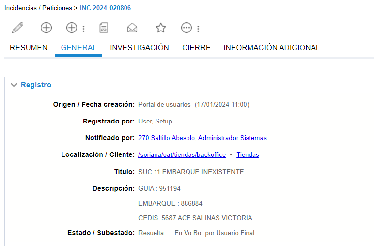

# EMBARQUE INEXISTENTE

**Titulo:** SUC 11 EMBARQUE INEXISTENTE

**Descripcion:** 

GUIA : 951194

EMBARQUE : 886884

CEDIS: 5687 ACF SALINAS VICTORIA

Para estos casos donde se comentan que no pueden visualizar el embarque, es necesario consultar el embarque en MySql con el siguiente procedimiento.

    call consultarEmbarque();

Si se muestra que el embarque ya tienen una fecha de conclusion, esto quiere decir que ya finalizo el embarque y por lo tanto es necesario acudir con el equipo de CEDIS para que repliquen el embarque y este pueda ser visualizado de forma correcta.

Ejemplo del mensaje

    Hola buen dia, su apoyo con el siguiente embarque que no se visualiza por pare de la sucursal, ya se concluyo

    Ticket: INC 2024-020806
    Embarque: 886884
    Sucursal: 270

