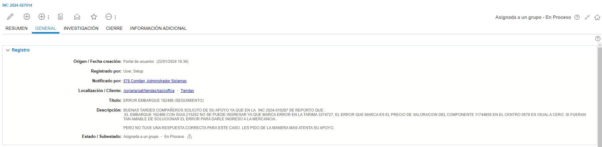
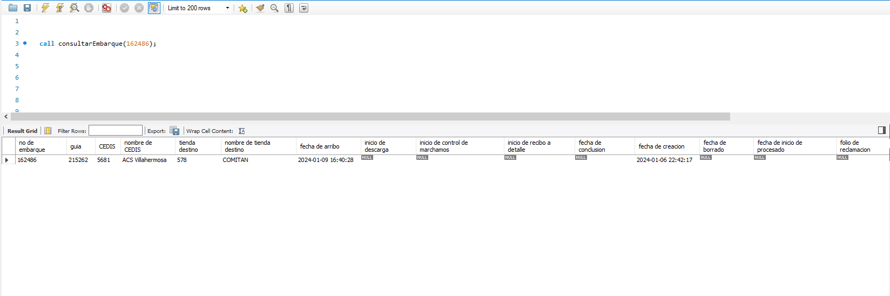
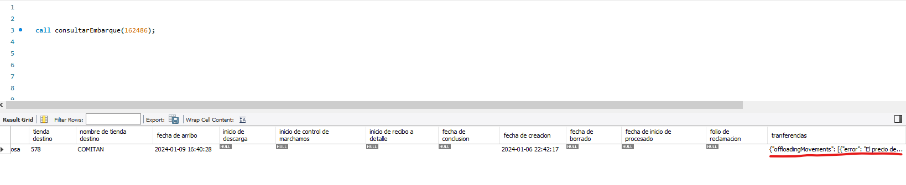
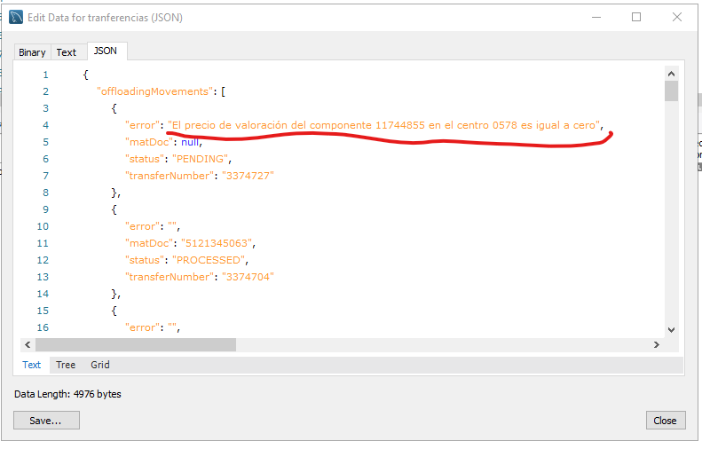
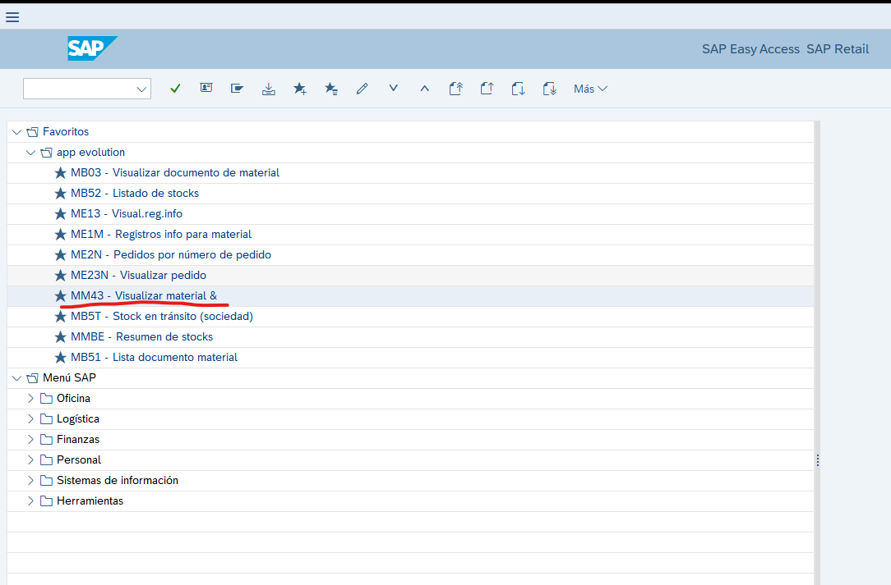
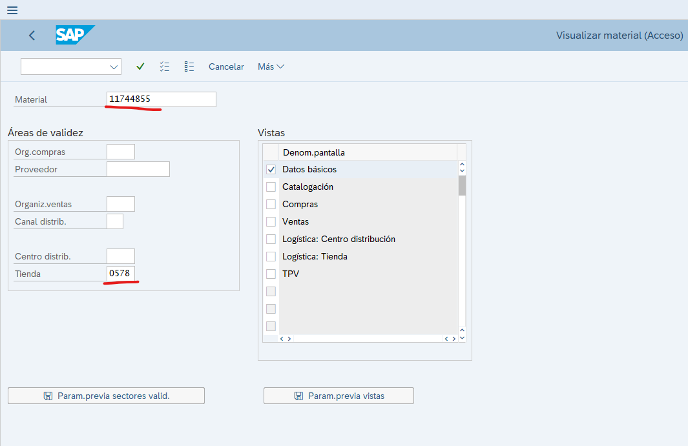
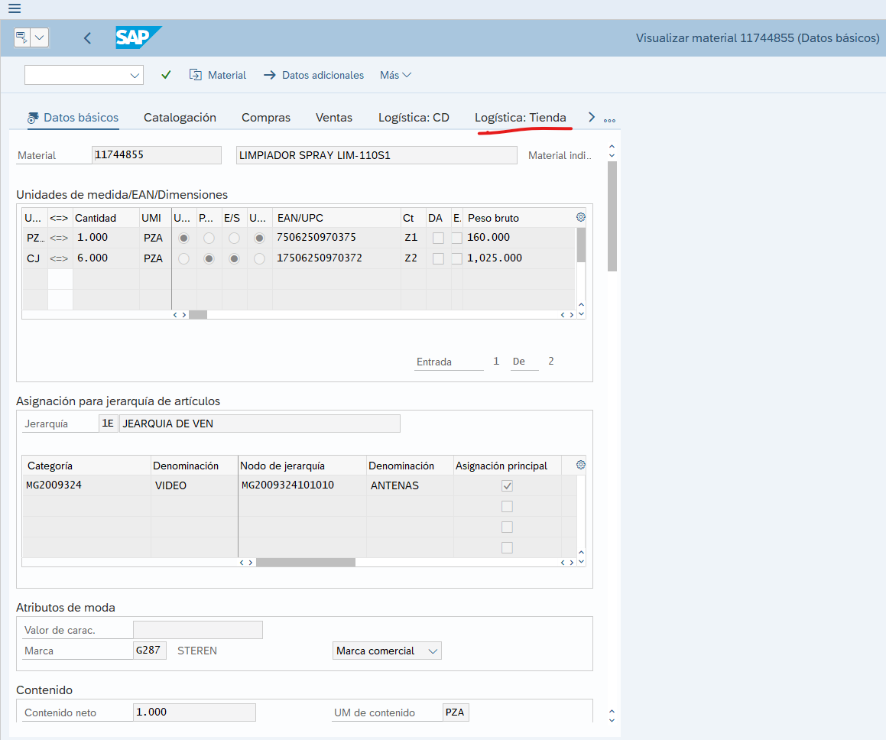
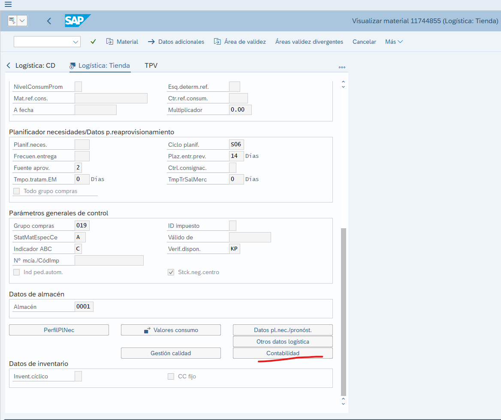
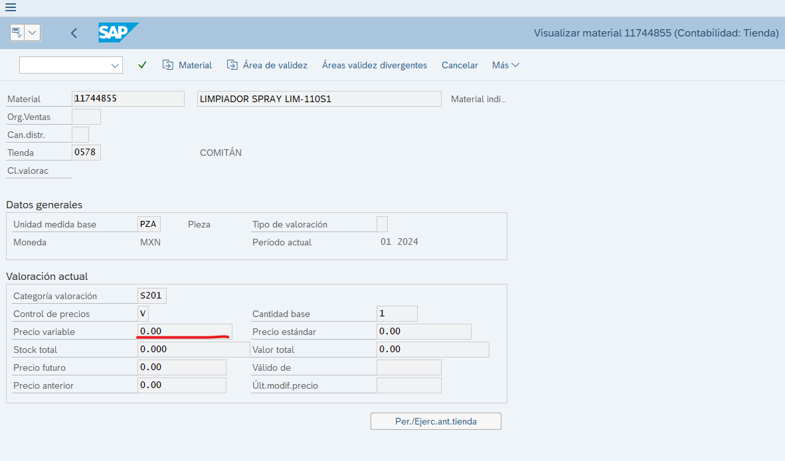

# El precio de valoración del componente 11744855 en el centro 0578 es igual a cero

**Título:** ERROR EMBARQUE 162486 (SEGUIMIENTO)

**Descripción:**
BUENAS TARDES COMPAÑEROS SOLICITO DE SU APOYO YA QUE EN LA 	INC 2024-010287 SE REPORTO QUE: 
 EL EMBARQUE 162486 CON GUIA 215262 NO SE PUEDE INGRESAR YA QUE MARCA ERROR EN LA TARIMA 3374727, EL ERROR QUE MARCA ES EL PRECIO DE VALORACION DEL COMPONENTE 11744855 EN EL CENTRO 0578 ES IGUAL A CERO. SI FUERAN TAN AMABLE DE SOLUCIONAR EL ERROR PARA DARLE INGRESO A LA MERCANCIA. 

PERO NO TUVE UNA RESPUESTA CORRECTA PARA ESTE CASO. LES PIDO DE LA MANERA MAS ATENTA SU APOYO.

Es necesario que se proporciones los datos del ***Embarque*** y el ***Cedis***

En este caso son los siguentes

**Cedis:** 5681

**Embarque:** 162486

Para comenzar con el analisis es necesario revisar tanto en Mysql como en SAP

En MySql se hace la consulta del Embarque con el siguiente SP

    call consultarEmbarque(246027);

Se va al final para sonsultar el dato que trae en ***tranferencias***

Se abre el dato para visualizarlo de mejor manera 

Si se muestra el este error

    "error": "El precio de valoración del componente 11744855 en el centro 0578 es igual a cero"

Se ingresa a SAP y se va a la **MM43: Visualizar material**

Dentro tendremos que proporcionar los datos que nos aparecen en el error, el materias y la tienda, se selecciona el check de Datos basicos

**Material:** 11744855

**Tienda:** 0578

Una ves se ingreses los datos y se precione ENTER se cargaran los datos siguientes, en el cual tendremos que ir al apartado de **Logistica: Tienda**

Ya que estemos en el apartado de **Logistica: Tienda** daremos scroll asta ver el apartado de **Contabilidad** y daremos click en este.

Este nos mostrara mas informacion, pero el dato que nos interesa es el de **Precio variable**

Si este dato esta en 0.00 que es lo que nos decia el error inicialmente, este debera de ser reportado con el en cargado de SAP correspondiente del tema, en este caso asta el momento es Caudia, su correo: claudiavcb@soriana.com, donde se debera anexar la evidencia que se encontro donde se muestre que el material tienen el precio de 0.00, y agregar los siguientes datos

* Embarque
* Cedis
* Material
* Centro 

***Nota:*** El centro tambien es conocido como tienda o sucursal

Una ves que alla respuesta de que el problema fue atendido se debera mandar aVoBo donde se indique que el problema ya fue solucionado.

En dado caso que el Precio variable cuente con algun dato en la cunsulta que no se el 0.00 se debera de mandar a VoBo donde se indique que el problema ya fue solucionado, ya que en ocasiones el Material puede estar causando mas de una incidencia reportada y este ya se corrigio en alguna otra.

