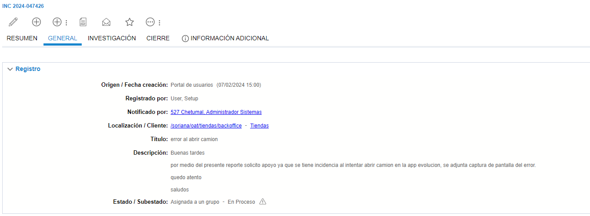
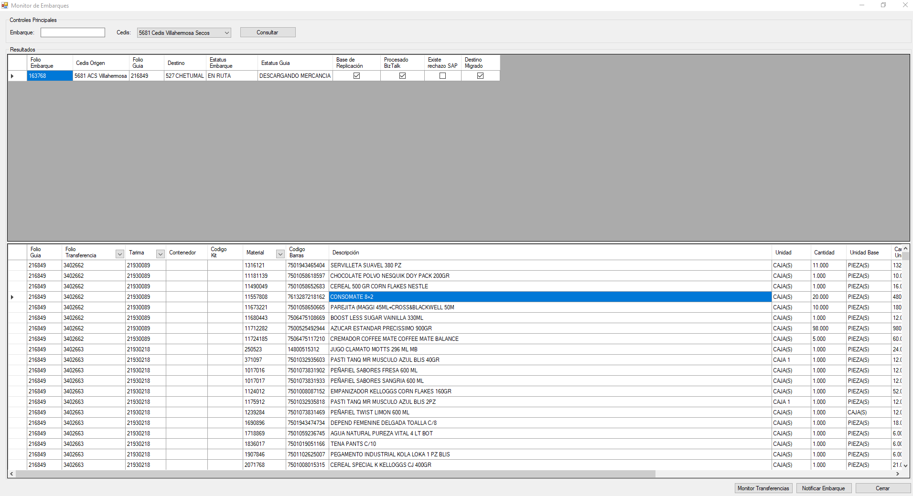
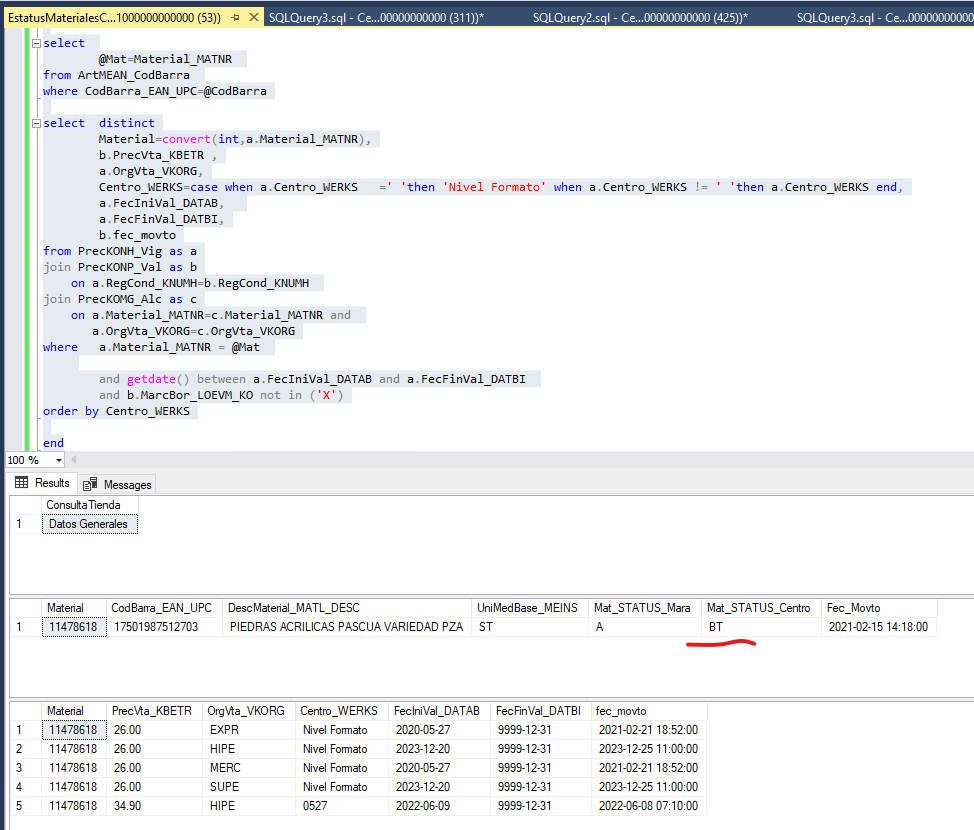

# Embarques con materia BT en SideCarProdDB pero estaus A en SAP
# Pedido igual a la orden de compra, posiciones que no se ven

**Título:**	
error al abrir camion

**Descripción:**	
Buenas tardes 
por medio del presente reporte solicito apoyo ya que se tiene incidencia al intentar abrir camion en la app evolucion, se adjunta captura de pantalla del error.

quedo atento 

saludos

Para este caso se compare el siguiente erro

El cual es un error comun y se va a verificar tambien al ***Monitor de embarques*** y ***MySql*** para comprobar su estatus ahi

***Monitor de embarques***

En MySql no se tomo el error ya que se soluciono el incidente pero precentaba el mismo que la imagen.

Se toma el nomero de pedido

**Orden de Compra:** 2106884488
**Posicion:** 5

Se va al monitor de embarque y se filta por el numero de orden, si traen muchas transferencias se filtra tambien por Folio de transferencia. Como se muestra en el error se va a la que se indica como se ve en la imagen 

Tomamos el material y vamos a SAP

En la MM43 vamos buscar el material

Se ejecuta por material y tienda, se selecciona Datos basicos y se ejecuta.

De esta consulta nos importan dos datos, los que estan señalados de datos basicos

UMA: CJ
EAN/UPC: 17501987512703

De Logistica de tienda nos interesa el campo de

StatMatEspecCe: A

Que son los datos que se tienen para este caso

Con estos datos vamos a ir a SQL server para verificar el estatus de los materiales ahi tambien

Vamos a ir al servidor de **azsidecarnode1**

Ahi vamos a ejecutar el siguiente escript cambiando los siguientes datos, que estos se cambian a corde a los datos de cada problema

***set @Centro= 527***
**set @CodBarra=17501987512703**

    -- Server donde esta la base de datos azsidecarnode1
    use SideCarProdDB
    set nocount on
    declare 
            @Mat varchar(40), 
            @Centro varchar(20),
            @CodBarra decimal (14,0)

    set @CodBarra=17501987512703--5548--255860000008
    set @Mat=null
    set @Centro= 527
    set @Mat='000000000000000000'+@Mat
    set @Mat=right(@Mat,18)
    set @Centro='0000'+@Centro
    set @Centro =right(@Centro,4)

    if @Centro is not null
    begin
    select ConsultaTienda='Datos Generales'
    select  
            Material=convert(int,a.Material_MATNR),
            a.CodBarra_EAN_UPC,
            b.DescMaterial_MATL_DESC,
            c.UniMedBase_MEINS,
            Mat_STATUS_Mara=c.StatMat_PUR_STATUS,
            Mat_STATUS_Centro=d.StatMat_PUR_STATUS,
            a.Fec_Movto

    from ArtMEAN_CodBarra as a
    join ArtMAKT_Desc as b
        on a.Material_MATNR=b.Material_MATNR
    join ArtMARA_Material as c
        on b.Material_MATNR=c.Material_MATNR 
    join ArtMARC_Centros as d
        on c.Material_MATNR=d.Material_MATNR
    where a.CodBarra_EAN_UPC=@CodBarra and d.Centro_WERKS=@Centro 

    select 
            @Mat=Material_MATNR 
    from ArtMEAN_CodBarra 
    where CodBarra_EAN_UPC=@CodBarra

    select  distinct
            Material=convert(int,a.Material_MATNR),
            b.PrecVta_KBETR	,
            a.OrgVta_VKORG,
            Centro_WERKS=case when a.Centro_WERKS	=' 'then 'Nivel Formato' when a.Centro_WERKS != ' 'then a.Centro_WERKS end,
            a.FecIniVal_DATAB,	
            a.FecFinVal_DATBI,
            b.fec_movto
    from PrecKONH_Vig as a
    join PrecKONP_Val as b
        on a.RegCond_KNUMH=b.RegCond_KNUMH 
    join PrecKOMG_Alc as c
        on a.Material_MATNR=c.Material_MATNR and 
        a.OrgVta_VKORG=c.OrgVta_VKORG
    where   a.Material_MATNR = @Mat 
            and (a.Centro_WERKS=' ' or a.Centro_WERKS in (@Centro)) 
            and (c.Centro_WERKS=' ' or c.Centro_WERKS= @Centro )
            and getdate() between a.FecIniVal_DATAB	and a.FecFinVal_DATBI 
            and b.MarcBor_LOEVM_KO not in ('X')
    end
    --
    else

    begin

    select ConsultaTienda='Datos Generales'
    select  d.Centro_WERKS,
            Material=convert(int,a.Material_MATNR),
            a.CodBarra_EAN_UPC,
            b.DescMaterial_MATL_DESC,
            c.UniMedBase_MEINS,
            Mat_STATUS_Mara=c.StatMat_PUR_STATUS,
            Mat_STATUS_Centro=d.StatMat_PUR_STATUS,
            a.Fec_Movto

    from ArtMEAN_CodBarra as a
    join ArtMAKT_Desc as b
        on a.Material_MATNR=b.Material_MATNR
    join ArtMARA_Material as c
        on b.Material_MATNR=c.Material_MATNR 
    join ArtMARC_Centros as d
        on c.Material_MATNR=d.Material_MATNR
    where a.CodBarra_EAN_UPC=@CodBarra --and d.Centro_WERKS=@Centro 
    order by d.Centro_WERKS

    select 
            @Mat=Material_MATNR 
    from ArtMEAN_CodBarra 
    where CodBarra_EAN_UPC=@CodBarra

    select  distinct
            Material=convert(int,a.Material_MATNR),
            b.PrecVta_KBETR	,
            a.OrgVta_VKORG,
            Centro_WERKS=case when a.Centro_WERKS	=' 'then 'Nivel Formato' when a.Centro_WERKS != ' 'then a.Centro_WERKS end,
            a.FecIniVal_DATAB,	
            a.FecFinVal_DATBI,
            b.fec_movto
    from PrecKONH_Vig as a
    join PrecKONP_Val as b
        on a.RegCond_KNUMH=b.RegCond_KNUMH 
    join PrecKOMG_Alc as c
        on a.Material_MATNR=c.Material_MATNR and 
        a.OrgVta_VKORG=c.OrgVta_VKORG
    where   a.Material_MATNR = @Mat 
        
            and getdate() between a.FecIniVal_DATAB	and a.FecFinVal_DATBI 
            and b.MarcBor_LOEVM_KO not in ('X')
    order by Centro_WERKS

    end

    

Como se ve aqui se encuentra en estatus de BT por lo cual es lo que esta ocasionando que no se pueda concluir la descarga del embarque.

Esta situacion es un caso muy especial y no se deben borrar materiales solo porque ocasionan problemas en la descarga, pero como se comento es  un caso especial en el cual si se realizo la eliminacion del material con el siguiente SP

    -- borrar materiales n casos extraordinarios pero no deberia de pasar ya
    call borrarMaterialDeEmbarque (Embarque, Materia, Sucursal);
    call borrarMaterialDeEmbarque (163768, 11478618, 527);