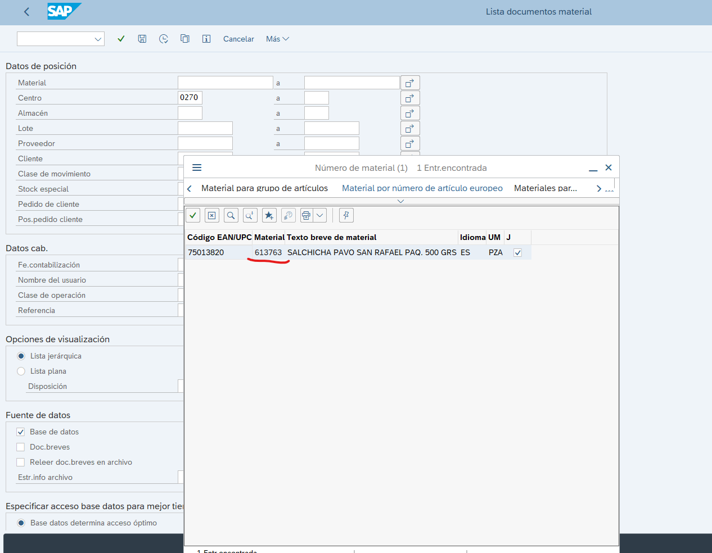

# NotaEntradProvedorTiendaArticulosNoCatalogados

**Título:** SUC 270 NO PERMITE LIBERAR FACTURAS SIGMA

**Descripción:**

BUEN DIA 

SOLICITO DE SU APOYO CON LAS FACTURAS MANUALES 

8548384962 // 8548406105

EEROR INTERNO ACERCATE CON TU SUPERVISOR CON ESTE MENSAJE POR FAVOR INTRODUZCA LOTE

EN este caso se debe ir a SAP para revisar el estatus del folio que nos proporcionan. Datos que se necesitan:

Material: 75013820

Sucursal: 270

Vamos a la ***MB51*** para realizar la consulta.

Una ves aqui ingresamos los datos como se muestra la imagen  y se le da click en el icono marcado con rojo, se sa click para que aparesca una opcion que te permitirar buscar en diferentes categorias.

Una ves ahi se busca la categoria de ***Material por numero de articulo europeo***

Se ingresa el Material y se ejecuta.

Estoy te llevara nuevamente a la pantalla inicial de la MB51 pero con el material correcto para ejecutar ahi la consulta.

Una ves ejecutado y se muestren movimientos despuesde la fecha, se toma captura y esta se anexa en el VoBo

