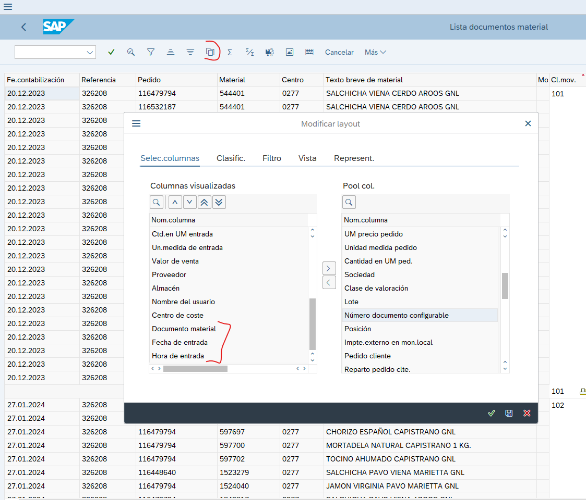

# NOTA DE ENTRADA DUPLICADA mov 101 en sap

**Titulo:** NOTA DE ENTRADA DUPLICADA FOLIO 326208 EN SISTEMA SAP

**Descripcion:** 

SE Solicita correccion de la Nota de Entada Numero de Folio 326208 , debido a que el Sistema SAP   Duplico la Entrada en Todos los Articulos. 
SE ADJUNTA EVIDENCIA , ACUSES DE RECIBO Y FACTURA DEL PROVEEDOR 

Para el analisis de este caso es necesario ir a SAP y consultar este folio en la ***MB51***

Una ves aqui debemos ingresar el folio y el centro, para este caso tenemos que es

**Folio:** 326208

**Sucursal:** 277

Se ejecuta y se mostrara una pantalla como la siguiente.

Se subrrayo una parte ya que este ticket ya fue solucionado, despuesde esto hay qque ver la lista detallada, el icono que esta señalado con rojo

Mismo caso hay que dar click en el icono surrayado en rojo y despues pasar los datos tambien marcados de la parte derecha a la izquierda para que se muestre la informacion, los datos ***documento material***, **fecha y hora**.

Como se muestraque hay una entrada duplicada, tanto por la hora como el ***Documento material*** como por la ***hora de entrada***.
Se da click en el Documento material que se ve repetido y se van a revisar los dos casos para verificar que solo tengan el movimiento 101.

Se da click en Datos del pedido y se da click en el Pedido

Se debe de mostrar solo el moviemiento 101, como se menciono anteriormente este ticket ya es uno resuelto por lo cual se borro el otro movimiento. Se realiza el mismo procedimiento para el otro Documento de material

Verificando esto, se procede a mandar correo a Claudioa con las evidencias y capturas donde se muestra que hay elementos duplicados y el movimieno 101 y se manda el Documeto Material que se va a borrar, en este caso es el untilmo que se realizo.

Ejemmplo de mensaje en el correo:

    Hola Claudia

    Si nos pudieras apoyar con una reversa a los mov 101 del documento material

    5120757440

    Ya que llego duplicado a sap.

    Muchas gracias, quedo al pendiente

Finalmente una ves que nos respondan el correo o nos indiquen que se aplico la modificacion, es necesario verificar en SAP nuevamente y s debe de mostrar una pantalla como la siguiente donde se muestre que se elimino.

Se envia a VoBo y se le adjunta esta captura como prueba de que quedo realizada la accio solicitada.

