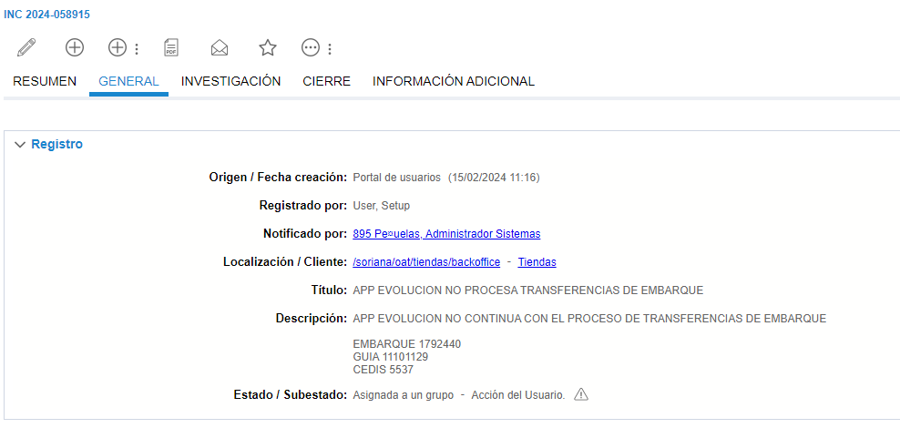
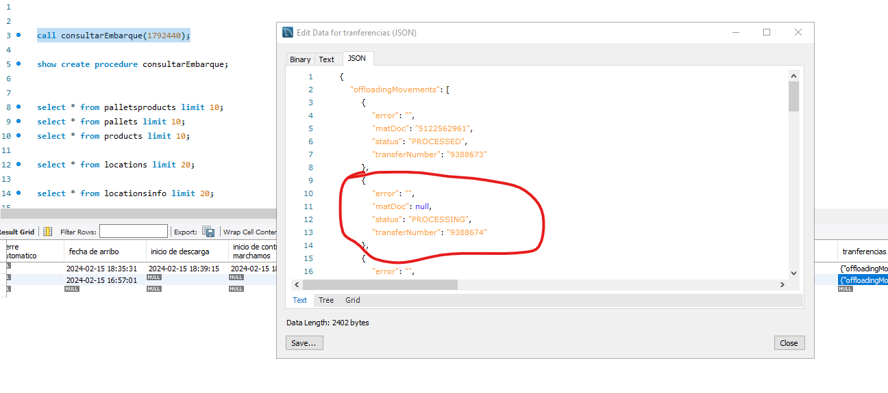
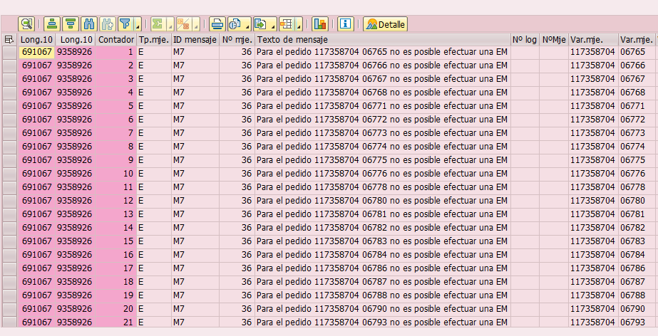

# Embarques con materia BT en SideCarProdDB pero estaus A en SAP
# Pedido igual a la orden de compra, posiciones que no se ven

**Título:**
APP EVOLUCION NO PROCESA TRANSFERENCIAS DE EMBARQUE

**Descripción:**	
APP EVOLUCION NO CONTINUA CON EL PROCESO DE TRANSFERENCIAS DE EMBARQUE

EMBARQUE 1792440
GUIA 11101129
CEDIS 5537

Para este caso se va a consultar en **MySql** el embarque para revisar si tiene algun problema.

    call consultarEmbarque(1792440);

Como tal no se visualisa el problema que esta ocurriendopero se muestra el siguiente **Json**

    {
        "error": "",
        "matDoc": null,
        "status": "PROCESSING",
        "transferNumber": "9388674"
    }

El cual la trasferencia aun esta en ***PROCESSING*** y el matDoc esta en ***null***

Al ver esto se debe revisar el dato Claudia comento lo siguiente: 

    Equipo APP cuando no se tenga visibilidad del mensaje de error desde MySql , se pueden apoyar con el equipo de SAP para que les compartan la respuesta de la tabla ZTMM_MSG_DOC desde la SE16N . Solo es necesario que le compartan el nuemro de la trasnferencias en cuestion. 

Por lo cual es necesario compartir esa transferencia para que nos muestren su estatus. Para este caso nos responde con lo siguiente

## Hasta aqui llego por el momento