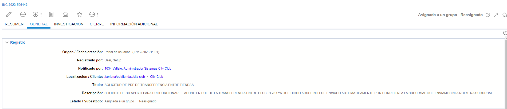
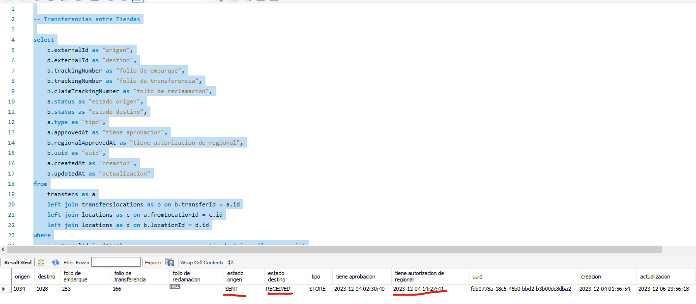

# PROPORCIONAR EL ACUSE EN PDF NO FUE ENVIADO AUTOMATICAMENTE

**Titulo:** SOLICITUD DE PDF DE TRANSFERENCIA ENTRE TIENDAS

**Descripcion:** SOLICITO DE SU APOYO PARA PROPORCIONAR EL ACUSE EN PDF DE LA TRANSFERENCIA ENTRE CLUBES 283 YA QUE DICHO ACUSE NO FUE ENVIADO AUTOMATICAMENTE POR CORREO NI A LA SUCURSAL QUE ENVIAMOS NI A NUESTRA SUCURSAL

Para comenzar con el analisis de esta incidencia, es necesario tener los siguientes datos

Número de transferencia:	283
Sucursal:	1034

Con esto podremos ejecutar el siguiente script para revisar el detalle de la transferencia.

    -- Transferencias entre Tiendas

    select
        c.externalId as "origen",
        d.externalId as "destino",
        a.trackingNumber as "folio de embarque",
        b.trackingNumber as "folio de transferencia",
        b.claimTrackingNumber as "folio de reclamacion",
        a.status as "estado origen",
        b.status as "estado destino",
        a.type as "tipo",
        a.approvedAt as "tiene aprobacion",
        b.regionalApprovedAt as "tiene autorizacion de regional",
        b.uuid as "uuid",
        a.createdAt as "creacion",
        a.updatedAt as "actualizacion"
    from
        transfers as a
        left join transferslocations as b on b.transferId = a.id
        left join locations as c on a.fromLocationId = c.id
        left join locations as d on b.locationId = d.id
    where
        c.externalId in (1034)						-- Tienda Origen (la que envia)
        and a.type = "STORE"
        and a.trackingNumber in (283)	-- Folio de la tienda que envia
        -- and d.externalId = 307
        ;

    -- fromLocationId 	= Tienda Origen
    -- b.locationId 	=  Tienda Destino
    -- a.trackingNumber	= Folios de Tienda que envia
    -- b.trackingNumber	= Folios de Tienda que recibe

Con lo cual se podra observar la siguien informacion

Los datos a tomar en cuanta seria los que vienen remarcados, los cuales si contienen informacion y podemos comprobar que si fue enviada y recibida la transferencia.

Una ves se validen estos datos, procedemos a enviar un correo a Daniel, correo: daniel@arvolution.com para pedir ayuda con la incidencia.

Ejemplo de correo

