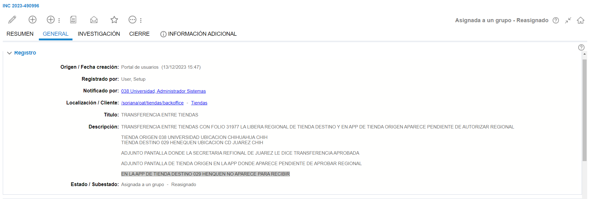
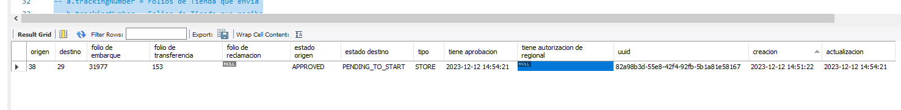

# EN LA APP DE TIENDA DESTINO 029 HENQUEN NO APARECE PARA RECIBIR

**Título:** TRANSFERENCIA ENTRE TIENDAS

**Descripción:**

TRANSFERENCIA ENTRE TIENDAS CON FOLIO 31977 LA LIBERA REGIONAL DE TIENDA DESTINO Y EN APP DE TIENDA ORIGEN APARECE PENDIENTE DE AUTORIZAR REGIONAL

TIENDA ORIGEN 038 UNIVERSIDAD UBICACION CHIHUAHUA CHIH
TIENDA DESTINO 029 HENEQUEN UBICACION CD JUAREZ CHIH

ADJUNTO PANTALLA DONDE LA SECRETARIA REFIONAL DE JUAREZ LE DICE TRANSFERENCIA APROBADA

ADJUNTO PANTALLA DE TIENDA ORIGEN EN LA APP DONDE APARECE PENDIENTE DE APROBAR REGIONAL

EN LA APP DE TIENDA DESTINO 029 HENQUEN NO APARECE PARA RECIBIR

Para comenzar con el analisis de este incidente es necesario contar con los datos de folio de tienda que envia o que recibe, tienda origin o tienda destino.

Para este caso se contaba con los siguientes datos.

**Folio de transferencia:** 31977

**Tienda origen:** 038

**Tienda destino:** 029

Teniendo estos datos podemos ir a MySql y consultar con el siguie script para obtener los datos de la transferencia

    -- Transferencias entre Tiendas

    select
        c.externalId as "origen",
        d.externalId as "destino",
        a.trackingNumber as "folio de embarque",
        b.trackingNumber as "folio de transferencia",
        b.claimTrackingNumber as "folio de reclamacion",
        a.status as "estado origen",
        b.status as "estado destino",
        a.type as "tipo",
        a.approvedAt as "tiene aprobacion",
        b.regionalApprovedAt as "tiene autorizacion de regional",
        b.uuid as "uuid",
        a.createdAt as "creacion",
        a.updatedAt as "actualizacion"
    from
        transfers as a
        left join transferslocations as b on b.transferId = a.id
        left join locations as c on a.fromLocationId = c.id
        left join locations as d on b.locationId = d.id
    where
        c.externalId in (38)						-- Tienda Origen (la que envia)
        and a.type = "STORE"
        and a.trackingNumber in (31977)	-- Folio de la tienda que envia
        -- and d.externalId = 307
        ;

    -- fromLocationId 	= Tienda Origen
    -- b.locationId 	=  Tienda Destino
    -- a.trackingNumber	= Folios de Tienda que envia
    -- b.trackingNumber	= Folios de Tienda que recibe

Solo es necesario cambiar los datos correspondientes dado el caso.

Si el apartado de ***tiene autorizacion de regional*** esta en NULL como se muestra en la imagen se debe de enviar un correo a Daniel, correo: daniel@arvolution.com quien es el encargado de trartar estos temas.

Este seria un ejemplo de lo que se le puede decir en el correo 

    Buen día
    
    Tu apoyo para volver a enviar la solicitud de vobo al comprador ya que no visualiza los siguientes folios para 
    la tienda 38
    
    Tienda Destino:	029 HENEQUEN
    Número de transferencia:	31977
    Sucursal:	029

    Folio de transferencia: 153
    
    
    Saludos

