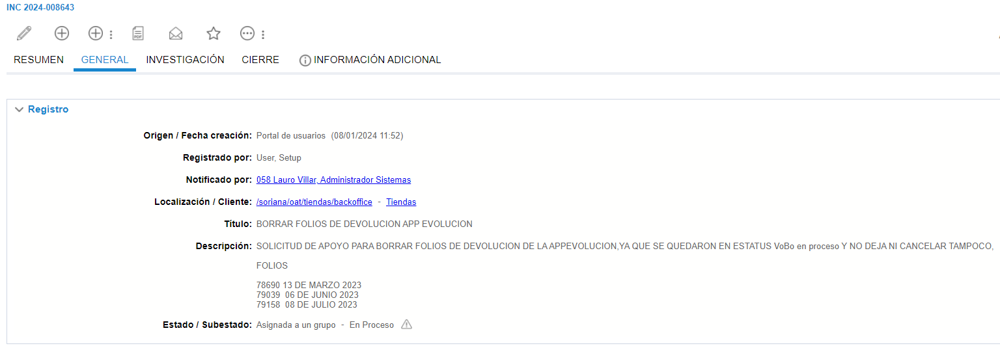
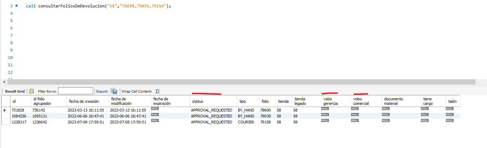

# Borrar o Cancelar Folio de Devolucion, Cambio de Estatus

**Título:** BORRAR FOLIOS DE DEVOLUCION APP EVOLUCION

**Descripción:**

SOLICITUD DE APOYO PARA BORRAR FOLIOS DE DEVOLUCION DE LA APPEVOLUCION,YA QUE SE QUEDARON EN ESTATUS VoBo en proceso Y NO DEJA NI CANCELAR TAMPOCO,

FOLIOS

78690 13 DE MARZO 2023
79039  06 DE JUNIO 2023
79158  08 DE JULIO 2023

En este caso es necesario revisisar en que estus se encuentran los folios que se solicitan cancelar en MySql con el siguiente procedimiento.

En este caso hay que ver tres columnas que son las importantes.

Estatus que se pueden cambiar:

* Pending shipping data
* to delivery by hand
* folio expired
* delivered
* aproval requested

| status                   | vobo gerencia            | vobo comercial          | Accion                               |
| ------------------------ | ------------------------ | ----------------------- | ------------------------------------------- |
| APROVAL_REQUESTED        | NULL o APROVAL_REQUESTED | NULL                    | Lo pueden cancelar desde genrencia, al menos que no se encuentre en el periodo conable, lo cual significa que ya no se podra realizar la accion, es un tema que aun no hay solucion, para cambio de estaus si se puede realizar. |
| APROVAL_REQUESTED        |       ACEPTED            | APROVAL_REQUESTED       | Se debe de anexar el VoBo para realizar la cancelacion o el cambio de estatus. |
| APROVAL_REQUESTED        |       ACEPTED            | NULL                 | Se debe de anexar el VoBo para realizar la cancelacion o el cambio de estatus. |
| APROVAL_REQUESTED        |       ACEPTED            | ACEPTED                 | Se debe de anexar el VoBo para realizar la cancelacion o el cambio de estatus. |
| APROVAL_REQUESTED        |                   | ACEPTED                 | Se debe de anexar el VoBo para realizar la cancelacion o el cambio de estatus. |

Estatus que no se pueden cambiar

* Cancel
* Rejected

En estos casos se manda a VoBo con el mensaje de que se encuentran en el estatus y que la accion no puede ser efectuada.