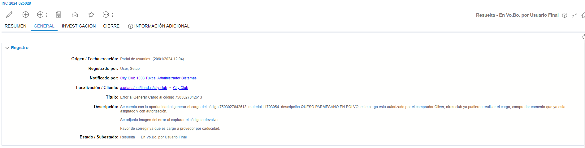
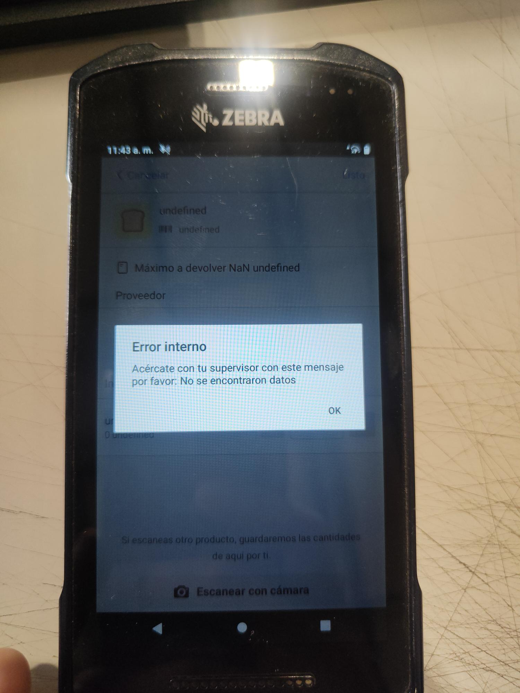

# Error al Generar Cargo al código 7503027842613

**Título:**
Error al Generar Cargo al código 7503027842613

**Descripción:**	
Se cuenta con la oportunidad al generar el cargo del código 7503027842613  material 11703054  descripción QUESO PARMESANO EN POLVO, este cargo está autorizado por el comprador Oliver, otros club ya pudieron realizar el cargo, comprador comento que ya esta asignado y con autorización.

Se adjunta imagen del error al capturar el código a devolver.

Favor de corregir ya que es cargo a provedor por caducidad.

Imagen del error

Se envia a VoBo con el siguiente mensaje

    Estimado usuario

    Para generar una nueva devolución debe hacer clic al botón de Nueva devolución y posterior escanear los productos, ya que si usa la cámara superior derecha esta se usa para escanear los folios agrupadores.
    Al momento que escanea un producto no lo detecta (porque está buscando un folio agrupador)
    Favor de validar si puede escanear los productos realizando un folio nuevo, si su incidencia persiste favor de comentarlo.

    Saludos