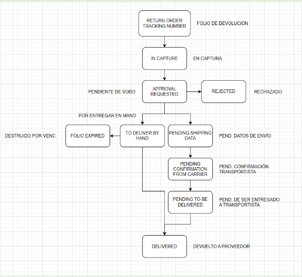

## Falta VoBo y No hay aprovacion GR ni CO	

Hola buen día, para realizar la cancelación aun se encuentran pendientes de aprobación de parte de gerencia así que ellos mismos podrían realizar la cancelación, favor de comunicarse con ellos.
En caso de que tengan algún erro que impida el hacerlo, favor de adjuntarlo para tener mayor información del tema y si es necesario realizar la cancelación necesitamos el VoBo para proceder con ella, ya sea los correos como evidencia o una imagen donde se muestren los folios en el correo y que se autoriza.

En caso que gerencia realice la cancelación favor de comunicarlo para enviar ticket a VoBo.

Saludos

## Tiene los dos VoBo pero esta pendiente de datos	

Hola buen día, favor de anexar el visto bueno donde se muestre la autorización por la parte comercial y los folios que se desea aplicar el cambio de estatus, ya sea el correo o una captura donde se muestren los datos solicitados.

Saludos

## Falta VoBo Comercial

Hola buen día, los folios que se solicitan cancelar están pendientes de aprobación por la parte comercial, por lo cual se puede solicitar con ellos la cancelación, o en dado caso de que no les aparezcan los folios para su cancelación o tengan algún problema, favor de anexar la evidencia.
En el caso que se requiera que nosotros realicemos la cancelación favor de anexar el visto bueno por parte de la parte comercial, de preferencia los correo donde se muestren los folios y se que aprueba su cambio de estatus.

En caso de que se pueda realizar la cancelación de forma correcta por pare de gerencia y comercial, favor de notificar para mandar a VoBo el ticket para su cierre.

Saludos

## Falta VoBo Comercial

Hola buen día, los folios que se solicitan cancelar están pendientes de aprobación por la parte comercial, 
En el caso que se requiera que nosotros realicemos la cancelación favor de anexar el visto bueno por parte de la parte comercial, de preferencia los correo donde se muestren los folios y se que aprueba su cambio de estatus.

Saludos

## Faltan agunos con aprovacion GR y otros de CO

Hola buen día, estos folios 11649 están pendientes de aprobación por parte de Gerencia, por lo cual ellos podrían realizar la cancelación, estos folios 11674 están pendientes de aprobación por la parte comercial así que se les puede solicitar su cancelación a ellos.
En caso de que de algún error que impida que alguna de las partes realice la acción requerida, es necesario anexar los vistos buenos por parte de estas, de preferencia de correos donde se autorice y se muestre los folios que se les desea cambiar el estatus.

Saludos

## Falta aprovacion Comercial

    Hola buen día, los folios que se solicitan cancelar están pendientes de aprobación por la parte comercial, por lo cual se puede solicitar con ellos la cancelación, o en dado caso de que no les aparezcan los folios para su cancelación o tengan algún problema, favor de anexar la evidencia.
    En el caso que se requiera que nosotros realicemos la cancelación favor de anexar el visto bueno por parte de la parte comercial, de preferencia los correo donde se muestren los folios y se que aprueba su cambio de estatus.

    En caso de que se pueda realizar la cancelación de forma correcta por pare del área comercial, favor de notificar para mandar a VoBo el ticket para su cierre.

    Saludos

## Falta aprovacion Comercial y da un error

Hola buen día, favor de anexar las pantallas de error que les están apareciendo para tener un mayor enfoque en la revisión del tema.
En caso que se requiera realizar el cambio por parte de nosotros es necesario anexar el visto bueno por parte de Comercial para poder proceder con el cambio solicitado, favor de anexar de preferencia los correos donde se autoricen y los folios los cuales se les va a realizar el cambio.

Saludos

## No se muestras los folios, solo el VoBo

Hola buen día, favor anexar el VoBo y que en ella se muestren los folios a cambiar de estatus, ya que se necesitan visualizar para poder comprobar que el cambio es para los folios que solicitan. En la imagen actual se muestra que fue autorizado pero no se muestran los folios.

Gracias, saludos

## Posiciones Compensadas	

Estimado usuario    

Favor de acercarse con el equipo de costos, ya que el folio que nos comparte cuenta con una recepción de factura que genero un cargo al proveedor, si quiere cancelar el folio debería solicitar la cancelación de la RE-L al equipo de costos y posterior validar nuevamente la cancelación en su app.   

 

Saludos  

## Estatus Rejected

Hola buen día, el folio que se comparte se encuentra en estatus Rechazado, por lo cual ya no procede su cancelación.

Saludos

Hola buen día, favor de anexar imágenes o capturas de pantalla donde se muestre el problema mencionado, si se requiere el cambio de estatus de nuestra parte es necesario que anexe el VoBo de gerencia, de preferencia los correos donde se muestren los folios que se desean cambiar de estatus y el visto bueno por parte de ellos para poder proceder con el cambio.

Saludos

## Siniestro sin VoBo

    Hola buen día,
    Solo se pueden eliminar embarques en el caso de siniestro y esto acompañado de su notificación por el área de riesgos, favor de contactar con el cedis para conocer el estatus del embarque.
    Es necesario que para realizar a cabo su eliminación se anexe el VoBo del área de Riesgos para proceder con la solicitud.

    Gracias, saludos

    Hola buen día,
    Es necesario que para realizar a cabo su eliminación se anexe el VoBo del área de Riesgos para proceder con la solicitud, ya que sin esta no se puede proceder con el borrado. En el VoBo se debe de mostrar el embarque que se desea borrar y el visto bueno para que se verifique que el embarque que se solicita borrar sea el correcto.
    Se pueden anexar los correos, pdf o imágenes donde esto sea visible
    
    Gracias, saludos

## Bloqueo a la compra

    Estimado usuario, 
    El mensaje que regresa el sistema no es un error, es una validación ya que un material con status de Bloqueo a la Compra no es válido para generar movimientos en la APP (Ajustes, Mermas, Transferencias, etc.) Se revisa en el sistema y se detecta que el material está en status BT para su tienda, cambio realizado por el área de compras.

## Bloqueo total

Estimado usuario, 
El mensaje que regresa el sistema no es un error, es una validación ya que un material con status de Bloqueo Total no es válido para generar movimientos en la APP (Ajustes, Mermas, Transferencias, etc.) Se revisa en el sistema y se detecta que el material está en status BT para su tienda, cambio realizado por el área de compras.

##  

Buen día,
El embarque tenia una incidencia con el material 11110302, le pedimos que reciba el embarque a detalle y que este articulo lo reciba como sobrante 
Saludos.

    Estimado usuario,
    ‌
    ‌El folio cuenta con movimiento fiscal en sistema, será necesario favor acercarse con el área de costos y solicitar la cancelación, para posteriormente generar las correcciones pertinentes.
    ‌
    ‌Saludos

## No mpliado para este centro

    Buena tarde estimado usuario 

    Favor de validar con su equipo de compras, ya que, para realizar una transferencia entre tiendas, los materiales tienen que estar extendidos y activos en ambos centros.  

    No es posible realizar una transferencia a un centro que no tenga dado de alta el material.  

    Saludos  
 